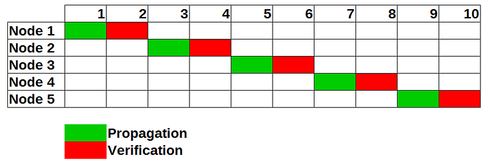
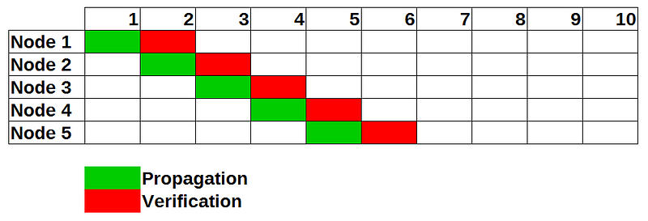
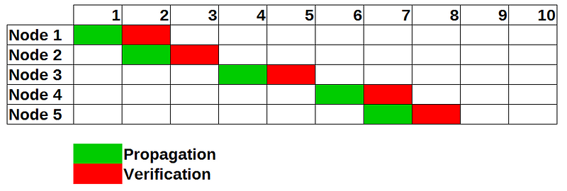

_This post was originally posted on 05.11.2019 on Medium, since then a lot has changed, I wanted to preserve the old article but I also added a small amendment_


_This is a joint work of Steffen Rattay and Marius van der Wijden_

## Motivation

An inherent limit of blockchain networks is the time needed for a block to reach all participants in a network. In Bitcoin the time between blocks was chosen as 10 minutes, such that all participants have the possibility to verify every block. In Bitcoin (BTC) it takes a block around 4.5 seconds to reach 50% of the network participants. (1)

In Ethereum (ETH) it can take up to 10 seconds to reach a distant node. (2) Maintaining a constant 15 second blocktime puts miners that are not connected to the big pools at a disadvantage as they have to wait for the blocks to get propagated.

During the conception of our own cryptocurrency SM²-Coin (6) we came across the same problem and proposed a new algorithm called probabilistic cut-through switching. The basic idea is two switch between different techniques for block propagation.

## Store-and-Forward

In traditional computer networking two approaches to the relaying of packets exist. The basic mode, **store-and-forward** (3) works like following:
Upon receiving a packet (block) the packet is checked for integrity before it is relayed to all connected nodes.



This method guarantees the integrity of every block, however every node has to check each block before forwarding it which increases the latency of each block. If an attacker publishes an invalid block, this block will not be forwarded by any honest node.

## Cut-Through Switching
The second method is called **cut-through switching** (4). Hereby the packet (block) is forwarded without checking the integrity of the block. After forwarding the block, its integrity is checked and, if valid, processed.



This greatly decreases the time each block has to travel through the network. However this speedup comes with a price. Attackers can now spam the network with invalid blocks that get forwarded. Since creating these blocks is free (the pow is checked in the verification phase) a small set of attackers can DOS the entire network. There have been sub-networks of the bitcoin network that operate on the cut-through switching principle. (5)

## Probabilistic Cut-Through Switching

We propose a new algorithm called **probabilistic cut-through switching**. The idea is that each node maintains a list of incoming connections. If a block arrives at the node, it checks (according to a metric) whether it should use store-and-forward or cut-through switching. If a peer is suspected to be an attacker (forwards to many invalid packages) the peer is dropped.



The network can switch to the fast cut-through switching if the network is not under attack and in the case of attacks switches back to the more robust store-and-forward algorithm. If the attacker is only connected to a small amount of nodes in the network, nodes that are sufficiently far away can still use the "fast mode". We also proposed to add a flag to a block-packet that every node has to set indicating whether it has verified the block or just forwarded it. If a peer would set this flag on an invalid block, they would be evicted from the peer-list.

## Metrics

There are several metrics we thought about while designing the algorithm. The most basic (implemented in go-ethereum (7)) works as following:

```
Each peer starts with a trust-level of 50. 
Each time a new block arrives the node generates a random number between 1 and 100. 
If the number is below the trust-level for this peer, the node uses the store-and-forward algorithm and verifies the block before sending. 
If the number is higher than the trust-level the node uses the cut-through algorithm. 
If the verification of the block was valid, the trust-level for the peer is increased.
Else if the verification of the block was invalid, the trust-level for the peer is decreased.
If the trust-level falls under a predefined level (e.g. 20%) the peer is evicted from the peer list and all connections to the peer are closed.
```

One can think about more sophisticated metrics to switch between the two algorithms.

## Implementation

I created a proof-of-concept implementation for ETHBerlin (which I didn't submit because I also worked on Laika - A proof-of-space testnet for ethereum (8)). The proof-of-concept only implements the metric shown before. Due to the current testing suite of go-ethereum assuming that every node uses store-and-forward and no invalid blocks are forwarded, the testsuite fails. But this could be changed in the future.
If you want to check it out, the code can be found here:
https://github.com/MariusVanDerWijden/go-ethereum
Feedback to it would be greatly appreciated!
Just msg me at https://twitter.com/vdWijden

## Amendment

Since I wrote this article in 2019 my perspective changed a bit. 

I realized that you can cut down on latency even more if you start propagating the blocks **before** you fully read them from the network. So nodes would need to compute beforehand if the next message was going to be relayed optimistically and could start relaying on the first bytes they received. 

In the meantime Ethereum switched to proof-of-stake which means that execution layer nodes (such as go-ethereum) do not relay blocks anymore.
However I also realized that this mechanism is a weaker, more forgiving form of peer scoring, which is used on the Consensus Layer extensively. Therefore the algorithms used by Consensus Layer nodes can potentially be used to build better metrics. 

This kind of probabilistic algorithm can also be used for propagation of other things that need to be checked before re-broadcasting, such as transactions on the execution layer, data on bittorrent, etc. The applicability of this algorithm goes far beyond block propagation.

While we initially only targeted (block) broadcasts with this algorithm, I came to realize that even _announce and retrieve_ schemes (where e.g. a transaction hash is announced to all peers and they need to fetch the transaction from the announcer) can be optimized with probabilistic cut-through switching. The peer would (in the optimistic case) forward the announcement to their peers _before_ retrieving the data themselves. If the retrieved data does not match, or the announcing peer does not respond to the request the peer score will be adjusted accordingly.


## Sources
(1) http://hackingdistributed.com/2013/11/25/block-propagation-speeds/
(2) https://ethstats.net/
(3) https://en.wikipedia.org/wiki/Store_and_forward
(4) https://en.wikipedia.org/wiki/Cut-through_switching
(5) https://www.falcon-net.org/faq
(6) https://sm2.network/
(7) https://github.com/MariusVanDerWijden/go-ethereum
(8) https://github.com/EthLaika